# Notes from Udemy Course Advanced CSS and SASS

### Table of Contents (under construction)
1. BEM syling of CSS
1. SASS Variables


### Resources
Images for project were found at: [Unspash](https://unsplash.com/)

Videos for project were found at: [Coverr](https://coverr.co/)

Looking up supported CSS in browsers: [Can I use](https://caniuse.com/)

Free software for changing video resolution: [HandBrake](https://handbrake.fr/)


### Process of building CSS sheet
- Block Element Modifier - BEM
    ```css
        .block {};
        .block__element {}; /* two underscores */
        .block__element--modifier {};
    ```

### What is SASS?
- CSS preprocessor, an extension of CSS
- Called preprocessor because a compiler is needed to change it to CSS code
- Two syntax methods, SASS and SCSS, SCSS is used in this course
- [List of resources](https://github.com/HugoGiraudel/awesome-sass) for SASS.
- **Features** ([Link to CodePen](https://codepen.io/zolkocarbon/pen/XEmJJg) using all examples below)
    + Variables: for reusable values such as color and font size
    ```scss
    $color-primary: #f9ed69; //comment in SASS
    ```

    + Nesting: nest selectors inside one another
        ```scss
        .navigation {
            list-style: none;
            float: left;

            li {
                display: inline-block;
                margin-left: 30px;

                &:first-child {
                margin: 0;
                }

                a:link { //translates to .navigation li a:link {}
                @include style-link-text($color-text-dark);
                } 
            }
        }
        ```
    + Operators: for mathmatical operations inside CSS (example below in [Functions](#functions))
    + Partials and imports: to write CSS in different files and import them all into one single file
    + Mixins: to write reusable pieces of CSS code
        ```scss
            @mixin clearfix {
                &::after {
                    content: "";
                    clear: both;
                    display: table;
                }
            }

            nav {  
                @include clearfix
            }
        ```
        A mixin with an argument
        ```scss
            @mixin style-link-text($color) {
                text-decoration: none;
                text-transform: uppercase;
                color: $color;
            }

            .btn-hot:link {
                @include style-link-text($color-text-light);
            }
        ```
    + <a name="functions"> Functions: like mixins, with the difference that they produce a value for later use </a>
        ```scss
        @function divide($a, $b) {
            @return $a / $b;
        }

        nav {
            margin: divide(60, 2) * 1px;
        }
        ```
        SASS also features built-in functions. [Link to list](http://sass-lang.com/documentation/Sass/Script/Functions.html) of built in fuctions.
    + Extends: to make different selectors inherit declarations that are common to all of them
        Before using extends
        ```scss
        .btn-main:link,
        .btn-hot:link {
            padding: 10px;
            display: inline-block;
            text-align: center;
            border-radius: 100px;
            width: $width-button;
            @include style-link-text($color-text-light);
        }

        .btn-main {
          &:link {
            background-color: $color-secondary;
          }

          &:hover {
            background-color: darken($color-secondary, 15%);
          } // darken is built-in SASS function
        }
        ```
        After using extend
        ```scss
            %btn-placeholder {
                padding: 10px;
                display: inline-block;
                text-align: center;
                border-radius: 100px;
                width: $width-button;
                @include style-link-text($color-text-light);
            }

            .btn-main {
                &:link {
                  @extend %btn-placeholder;
                  background-color: $color-secondary;
                }

                &:hover {
                    background-color: darken($color-secondary, 15%);
                } // darken is built-in SASS function
            }
        ```
        Note: while this may look similar to a mixin the complied CSS code does look different.
        The extend will create a class selector .btn-main:link, .btn-hot:link {} while the mixin would 
        create duplicates of code in the btn-main and btn-hot seperate selectors.
    + Control directives: for writing complex conditionals and loops (not covered in this course)

## Nodejs installation and SASS setup
1. Install nodejs from [here](https://nodejs.org/en/) on your computer.
    > Note: I was having issues installing node. After an hour of searching forums it turned out that I needed to turn off the virus protection.

1. Confirm node is installed by typing *node -v* in the terminal. (I did this in the Visual Studio terminal)

1. Navigate into project folder using the terminal commands.

1. Create package.json file by typing *npm init* in the terminal.
    + The prompt will prompt several questions for creating the file. In most cases the fields can be left blank or default values used.
    + If you download/clone someone's project and want to install all dependencies simply run *npm install* in the terminal and 
    all dependencies in the package.json file will be installed. This illustrates the main purpose of this file. Another scenario is working on one project on more than one computer.
    + When uploading a project to a repository don't upload the node_modules file as it is not necessary.

1. Install SASS npm package by typing *npm install node-sass --save-dev* in the terminal.
    + The --save-dev saves the development dependencie in the package.json file.
    + Other packages such as jQuery should be saved as *--save* because they are non-development dependencies.
    + To uninstall a package (jQuery example) type *npm uninstall jquery --save* in the terminal.

## Creating and compiling SASS/SCSS file
1. Create sass folder.
1. Create main.scss file.
1. Copy all content of style.css into it.
1. Modify package.json file
    ```javascript
        "scripts": {
            "compile:sass": "node-sass sass/main.scss css/style2.css -w"
        },
    ```
    + *compile:sass* is the name of the command we will use in the terminal.
    + *sass/main.scss* is the name and location of the SASS file to compile.
    + *css/style2.css* is the CSS file you want SASS to create and it's location.
    + *-w* is a watch command that will keep the compiler running in the terminal and update the CSS file every time the SASS file is saved.
1. Type *npm run compile:sass* in the terminal to compile the SASS file.

## Automatically reloading a page on file changes
1. Run *npm install live-server -g* to install live-server globally
    + The *-g* is for a global installation of the package so that it could be used on any project.
1. Run *live-server* to activate the package which will automatically open the html file.
    + This will run a local server and refresh the page every time a page edit and save occurs.
    + For this to work with the SASS compiler we need two terminals running, one for the SASS compiler watching and one for this package.

## Natours project SASS Nesting
Note: original CSS file is style.css and it has a lot of annotation to the style. main.scss is now the new style sheet.
```scss
    .header {
        //some properties here for header selector
        &__logo-box {
            //this is equivalent to .header__logo-box
        }
    }
```
Example before applying SASS nesting
```scss
.header {
    height: 95vh;
    background-image: linear-gradient(
        to right bottom,
        rgba(126, 213, 111, 0.80),
        rgba(40, 180, 133, 0.80)),
        url(../img/hero.jpg);
    background-size: cover;
    background-position: top;
    clip-path: polygon(0 0, 100% 0, 100% 75vh, 0 100%);
    position: relative;
}

.header__logo-box {
    position: absolute;
    top: 4rem;
    left: 4rem;
}

.header__logo {
    height: 3.5rem;
    backface-visibility: hidden;
}
```
After nesting and SASS variables change
```scss
.header {
    height: 95vh;
    background-image: linear-gradient(
        to right bottom,
        rgba($color-primary, 0.80),
        rgba($color-primary-dark, 0.80)),
        url(../img/hero.jpg);
    background-size: cover;
    background-position: top;
    clip-path: polygon(0 0, 100% 0, 100% 75vh, 0 100%);
    position: relative;

    &__logo-box {
        position: absolute;
        top: 4rem;
        left: 4rem;
    }

    &__logo {
        height: 3.5rem;
        backface-visibility: hidden;
    }
}
```

## Natours Project 7-1 Architecture
1. [Link to 7-1 Architecture](https://github.com/HugoGiraudel/sass-boilerplate) example on GitHub as a Boilerplate.
1. Create *base* folder in sass folder.
1. Create *_base.scss* file inside base folder. All partial files start with an underscore for convention.
1. Add the following to the top of main.scss. This will include the partial. Note that the underscore and .scss are not required as shown here.
    ```scss
    @import "base/base";
    ```
1. Create remaining files in SASS folder which can be seen in this repo or the link above.

## Layout types
    + Float Layout: most supported in browsers and used in this project.
    + Flexbox
    + CSS Grid

## Implementing Float Layout
```scss
.row {
    max-width: $grid-width; //take up 1140px if available, 1140px is standard
    background-color: #eee;
    margin: 0 auto; //center row
    
    &:not(:last-child) { // all rows except the last one
        margin-bottom: $gutter-vertical;
    }

    .col-1-of-2 {
        width: calc((100% - #{$gutter-horizontal}) / 2);
        background-color: orangered;
        float: left;
        
        &:not(:last-child) { //margin for all columns except the last one (furthest right)
            margin-right: $gutter-horizontal;
        }
    }
}
```
Since the only property that will change between columns is the width we can move the rest of the styles to seperate selector
```scss
.row {
    max-width: $grid-width; //take up 1140px if available, 1140px is standard
    background-color: #eee;
    margin: 0 auto; //center row
    
    &:not(:last-child) { // all rows except the last one
        margin-bottom: $gutter-vertical;
    }

    @include clearfix;

    [class^="col-"] { //select all classes that start with "col-"
        background-color: orangered;
        float: left;
        
        &:not(:last-child) { //margin for all columns except the last one (furthest right)
            margin-right: $gutter-horizontal;
        }
    }

    .col-1-of-2 {
        width: calc((100% - #{$gutter-horizontal}) / 2);
    }
```
## Emmet in Visual Studio Code
+ This is an extension built-in to VSC that allows fast html writing.
+ [Instructors cheat sheet.](https://docs.emmet.io/cheat-sheet/)
+ To write line below type *.text* and then press TAB.
```html 
<div class="text"></div>
```
+ To write line below type *section.text* and then press TAB.
``` html 
<section class="text"></section>
```
+ *.composition>(img.composition__photo.composition__photo--p1)\*3* produces
    ```html
    <div class="composition">
        
        
        
    </div>     
    ```


## Next section of project <main>
+ Thinking about components: the section after the header has components such as buttons, typography and images.
+ How and why to use utility classes: to use a common style throught website
```scss
.u-center-text { text-align: center; }
```
+ How to use the *background-clip* property. This will allow the background to only show behind the text
```scss
background-image: linear-gradient(to right, $color-primary-light, $color-primary-dark);
-webkit-background-clip: text; // background gets clipped exactly where text is
color: transparent;
```
+ How to *transform* multiple properties simultaneously
```scss
transform: skewY(2deg) skewX(15deg) scale(1.1);
```
+ How to use the *outline-offset* property together with *outline* to create an outline around an image with an offset. Example can be found in [this file](sass/components/_composition.scss)
```scss
.composition {

    &__photo {
        outline-offset: 2rem;

    &:hover {
        outline: 1.5rem solid $color-primary;
}
```
+ How to style elements tha are NOT hovered while others are. Example can be found in [this file](sass/components/_composition.scss)
```scss
.composition {
    position: relative;
    transition: all 0.2s;

    &:hover &__photo:not(:hover) { 
        transform: scale(0.95);
    }

    &__photo {

        &:hover {
            transform: scale(1.05);
        }
    }
}
```

## Building the features section
#### How to include and use the icon font.
+ [Link to Linea](http://linea.io/) which is the icon font used in this course. Download all sets.
+ In this project we used the *basic/_ICONFONT/fonts* and *basic/_ICONFONTS/styles.css* files and moved them into the project css folder along with the [icon reference file](css/fonts/icons-reference.html)
+ While all sets were downloaded the features section uses fonts from all the options (SVG, PNG, Fonts) in order to get the gradient background effect for the icon.
+ Note: renamed styles.css to icon-font.css
+ Syle sheet was added to the index page
```html
<link rel="stylesheet" href="css/icon-font.css">
```

+ Use the icon reference file to identify which icon you want to use and add *icon-* in front of it as a class name

```html
<i class="feature-box__icon icon-basic-map"></i>
```
#### Another way to create the "skewed section" design.
+  [Used here](sass/pages/_home.scss) for this project.
+ This will skew all the content. The background image and the four boxes in the section. To undo the skew for the boxes look at the next section.
```scss
.section-features {
    transform: skewY(-7deg);
}
```
#### How and when to use the direct child.
+  Also [used here](sass/pages/_home.scss) in this project. Here we undo the skew for the four boxes in our feature section.
```scss
.section-features {
    transform: skewY(-7deg) translateY(-10rem);

    & > * { // select direct child, which in this case is .row
        transform: skewY(7deg);
    }
}
```
HTML for this section where direct child selected is row
```html
<section class="section-features">
    <div class="row">
    </div>
</section>
```

## Building the tours section
This section of the project has three rotating cards, covers perspective, backface-visibility, background blend models and box-decoration-break. Card properties are defined in [this file](sass/components/_card.scss)

#### How to use perspective in CSS
This property skews the item in a transform to give it a feeling of getting closer to the page. Like flipping page in a book.
This example has will rotate the card 180 degrees in the Y axis and skew the card during the rotation.

The lower the number in the *perspective* property the higher the skew effect.
```scss
.card {
    perspective: 150rem; // choose huge number, arbitrary
    -moz-perspective: 150rem; // firefox coverage

       &:hover &__side--front { // .card:hover .card_side--front
        transform: rotateY(180deg);
    }

    &:hover &__side--back {
        transform: rotateY(0);
    }    
}
```

#### How to use the backface-visibility property
In order to hide the back of the card we use this property
```scss
.card {

    &__side {
        backface-visibility: hidden;
```
#### Using background blend modes
This property blends layers, in our project its a gradient and an image. 

Using this property causes the image to overflow outside parent so the fix is to use `overflow: hidden`

Not supported in Internet Explorer.

[W3 Documentation for different modes](https://www.w3schools.com/cssref/pr_background-blend-mode.asp)
```scss
    // FRONT SIDE STYLING
.card {

   &__side {
       
        border-radius: 3px;
        overflow: hidden; //hides image overflow from image property "background-blend-mode" below

    &__picture{ //in child div of above selector
        background-blend-mode: screen;

        &--1 {
            background-image: linear-gradient(to bottom right, $color-secondary-light, $color-secondary-dark), 
            url(../img/nat-5.jpg)
        }
```

#### How and when to use `box-decoration-break`
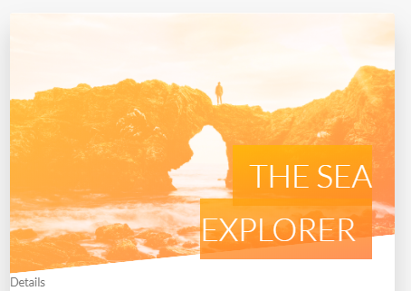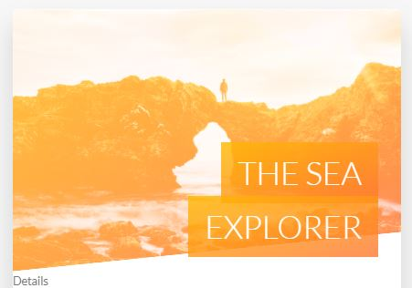

The `box-decoration-break` property is used to here for the text that overflows to the next line, "THE SEA EXPLORER".
On the left is the original element without the style applied. Since it overflows there is no padding added between the SEA and 
EXPLORER words as it is being treated as a single element. The right is after the property where the padding is applied evenly around the 
entire text.
```scss
.card {
    &__heading-span {
        padding: 1rem 1.5rem;
        -webkit-box-decoration-break: clone;
        box-decoration-break: clone;
```
```html 
<span class="card__heading-span card__heading-span--1">
        The Sea Explorer
</span>
```
## Building the customer feedback section

#### How to make text flow around shapes with `shape-outside` and `float`
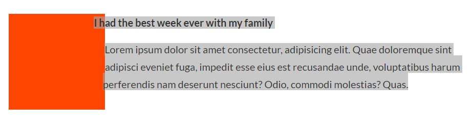
```scss
.story {
    &__shape {
        width: 15rem;
        height: 15rem;
        background-color: orangered;
        float: left;
    // Shape-outside is to get text to wrap around a shape
        -webkit-shape-outside: circle(50% at 50% 50%); //Safari
        shape-outside: circle(50% at 50% 50%); //only works if floated and has height/width defined.
```

#### Issues with applying `transform` property more than once on an element
In this section we want to skew the parent container and unskew the children. Before we did it like this:
```scss
.story {
    transform: skewX(-12deg); //skew parent

    & > * {
        transform: skewX(12deg); //unskew direct child
    }

    &__shape {
        float: left;
        transform: translateX(-3rem);
```
But notice that we have two transforms here. When CSS sees this it will only choose the last one so we need another solution.

Here, we apply the unskew directly to the elements we want and it fixes the issue above.
```scss
.story {
    transform: skewX(-12deg); //skew parent

    &__shape {
        float: left;
        transform: translateX(-3rem) skewX(12deg);
    
    &__text {
        transform: skewX(12deg);
    }
```

#### How to apply a `filter` to images
[Link to MDN example](https://developer.mozilla.org/en-US/docs/Web/CSS/filter)
```scss
.story {
    &:hover &__img {
        transform: translateX(-4rem) scale(1);
        filter: brightness(80%) blur(3px);
    }
```

> Note: if brightness and blur are reveresed in order the image shakes. 

#### How to create a background video covering an entire section
HTML section
```html
<div class="bg-video">
    <video class="bg-video__content" autoplay muted loop>
        <source src="img/video.mp4" type="video/mp4">
        <source src="img/video.mp4" type="video/webm">
            Your browser is not supported.
    </video>
</div>
```

SCSS section
```scss
.bg-video {
    // fit inside parent element
    position: absolute;
    top: 0;
    left: 0;
    height: 100%;
    width: 100%;

    z-index: -1; // to ensure it's behind everything
    opacity: .15; // to make it more clear
    overflow: hidden; // to clip the left/right sides so it doesn't overflow from container element

    &__content {
        height: 100%;
        width: 100%;
        object-fit: cover;
    }
}
```

#### How and when to use the `object-fit` propert
Example above. This property is intended for embedded media and determines how an element responds to height and width of it's content box.

[Link to examples of `object-fit`](https://css-tricks.com/almanac/properties/o/object-fit/)

## Form Section

#### How to implement "solid-color gradients"
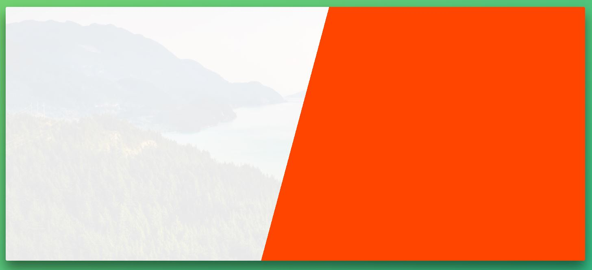

```scss
.book {
    background-image:   linear-gradient(    105deg,
                                            rgba($color-white, .9) 0%,
                                            rgba($color-white, .9) 50%,
                                            orangered 50%),
                        url(../img/nat-10.jpg);
    background-size: cover;
    border-radius: 3px;
    box-shadow: 0 1.5rem 4rem rgba($color-black, 0.5);

    height: 50rem;
}
```

#### How to use the `::input-placeholder` pseudo-element
Pseudo-elementsa are represented by the `::` notation and styles items that are on the page (as opposed to hover for example).

Pseudo-classes are represented by the `:` notation and style an element based on its state.

This selector is used to style the placeholder in a form input. Here we are changing the default color.
```scss
.form {

    &__input {
        &::-webkit-input-placeholder { //Safari + Chrome
            color: $color-gray-dark-2;
        }
```

#### How and when to use the `:focus`, `:invalid`, `placeholder-shown`, and `:checked` pseudo-classes
In this project we use the `:focus` and `:invalid` selectors to change the bottom margin on a form input based on whether it's valid or 
not.

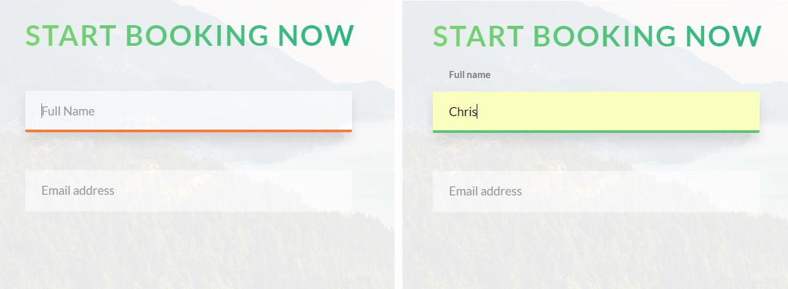

```scss
.form {
    &__input {
        &:focus {
            outline: none;
            box-shadow: 0 1rem 2rem rgba($color-black, .1);
            border-bottom: 3px solid $color-primary; // Green
        }

        &:focus:invalid {
            border-bottom: 3px solid $color-secondary-dark; // Orange
        }
```
#### How to use the `placeholder-shown` pseudo-classes along with the adjacent sibling property
This selector is used in this project to hide the input field label while the placeholder is displayed. As soon as the input
field is selected the label transitions in to full opacity and moves in the Y direction. 

The `+` is the adjacent sibling selector which selects the next ajacent element. The element on the right side of the + needs
to come after the element on the left in the HTML markup for this to work. Also, the general sibling `~` selector can be used if 
the desired element on the right does not come immediatly after the one on the left. Sibling elements must have the same parent element.

[Lecture 46 11:45](https://www.udemy.com/advanced-css-and-sass/learn/v4/t/lecture/8274518?start=706)

[W3Schools example](https://www.w3schools.com/css/tryit.asp?filename=trycss_sel_element_pluss) The parent is body and immediate adjacent is Paragraph 3.

[W3Schools other combinators](https://www.w3schools.com/css/css_combinators.asp)

```scss
.form {
    &__label {
        transition: all .3s;
        transform: translateY(-9rem);
    }

    &__input:placeholder-shown + &__label { //adjacent sibling (+), can also use general sibling (~)
       opacity: 0;
       visibility: hidden;
       transform: translateY(-4rem);
```


#### Techniques to build custom radio buttons
In CSS we cannot directly style the radio buttons so we can hide the default ones and create our own.
```scss
.form {
    &__radio-button {
            height: 3rem;
            width: 3rem;
            border: 5px solid $color-primary;   //creates the outline
            border-radius: 50%;                 //creates the circle shape
            display: inline-block;              //height and width only work on block elements
            position: absolute;                 //position it next to label
            left: 0;
            top: -.4rem;

            &::after { // creates the center checked section of radio button
                content: ""; // required for ::after
                display: block; // required for ::after
                height: 1.3rem;
                width: 1.3rem;
                border-radius: 50%;
                position: absolute;
                top: 50%;                           // ------------------
                left: 50%;                          // this section gets it centered on the parent
                transform: translate(-50%, -50%);   // ------------------
                background-color: $color-primary;
                opacity: 0;                         // to immitate unchecked
                transition: all 0.3s;
            }
        }

        &__radio-input:checked + &__radio-label &__radio-button::after {
            opacity: 1;                             // to immitate checked
        }
```

## Navigation section
#### What the "checkbox hack" is and how it works
Like custom radio buttons above, we create event behavior when a checkbox element is clicked. The navigation section has 
a fixed circle for the menu button and pressing it created a "when checked" transition to a gradient background.

[Link to CodePen of this menu](https://codepen.io/zolkocarbon/pen/Zxegpa?editors=1100)
```scss
.navigation {
    &__checkbox {
        display: none;
    }

    &__background { // green background
        height: 6rem;
        width: 6rem;
        border-radius: 50%;
        position: fixed;
        top: 6.5rem;
        right: 6.5rem;
        background-image: radial-gradient(#7ed56f, #28b485);
        z-index: 10;
        transition: all 1s;
    }

    &__checkbox:checked ~ &__background {
        transform: scale(80);
    }
```

#### Hot to create custom animation timing fuctions using cubic bezier curves
[Link to ease functions reference](http://easings.net/)

[Custom cubic-bezier functions](http://cubic-bezier.com/#.17,.67,.83,.67)

```scss
    &__nav {
        opacity: 0;
        width: 0; // to hide content
        transition: all .8s cubic-bezier(0.68, -0.55, 0.265, 1.55); // values from link above
```

#### How to animate "solid-color gradients"
Our menu uses a solid-color gradient on hover effect. The background is scaled to 215% in container which makes it hidden and able to cover entire container on hover. The `background-position` in the hover behavior shifts the background image.

[CodePen showing this behavior](https://codepen.io/zolkocarbon/pen/Zxegpa?editors=1100)
```scss
.navigation {
    &__link {
        &:link,
        &:active {
        display: block;
        background-image: linear-gradient(120deg, transparent 0%, transparent 50%, white 50%);
        background-size: 215%; // scales background image
        transition: all 0.9s;

        &:hover,
        &:active {
        background-position: 100%;
        color: #7ed56f;
        transform: translateX(1rem);
        }
```

Note: added mixin center_element -> can go through project to use in other areas

## Building a pure CSS Popup

#### How to create boxes with equal height using `display: table-cell;`
```scss
.popup {
    &__content { //both __left and __right are nested inside this selector
        display: table;
    }

    &__left {
        width: 33.33333%;
        display: table-cell;
        
    }

    &__right {
        width: 66.666667%;
        display: table-cell;
        vertical-align: middle;
    }
```

#### How to create CSS text columns
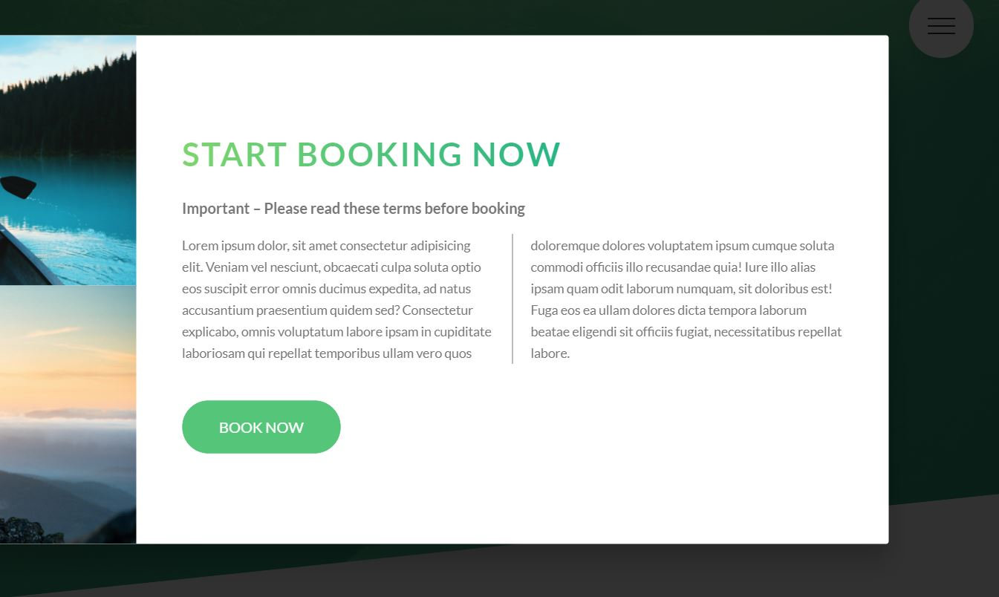

```scss
.popup {
    &__text {
        font-size: 1.4rem;

        column-count: 2;
        column-gap: 4rem; //overrides default value which is defined font-size
        column-rule: 1px solid $color-gray-dark; //line between columns
    }
```

#### How to automatically hyphenate words using `hyphens`
```scss
.popup {
    &__text {
    hyphens: auto; //only works with <html lang="en"> defined
    // also, for Chrome only works on Android/Mac platforms
```

#### How to use the `:target` pseudo-class
This section adds the functionality to open and close the popup. 

The popup is opened through the following changes.

HTML: 
```html
<a href="#popup" class="btn btn--white">Book now!</a> 
<!-- add #popup to desired button, this will be the anchor link -->

<div class="popup" id="popup">
    <!-- add id of popup to section with desired content -->
```
SCSS:
```scss
.popup {
    // Hide popup
    opacity: 0;
    visibility: hidden;
    transition: all .3s;

    // Show popup
    &:target {
        opacity: 1;
        visibility: visible;
    }
```

To close the popup, we add an html button that changes the target from the popup id to another id
```html
<section class="section-tours" id="section-tours">
<!-- add id to section where the popup buttom originated -->
<a href="#section-tours" class="popup__close">&times;</a>
<!-- add a link element in the popup to change the target -->
```

## Mobile-first vs Desktop-first
The instructor has been desigining this project from a desktop first approach and will add media queries to shrink the design for smaller
screens.

Media queries don't add any specificity to selectors, so code order matters. Media queries should therefore be added to the end.

#### Selecting our breakpoints
BAD way(most common): set breakpoints for specific devices such as iPhone, iPad. Too secific and not very future proof for evolving mobile devices.

GOOD way: pick most common devices, group them and pick breakpoints for the groups. Used in this project. Use [this resource](http://gs.statcounter.com/screen-resolution-stats) to get common
screen resolutions. Image below is from this website.
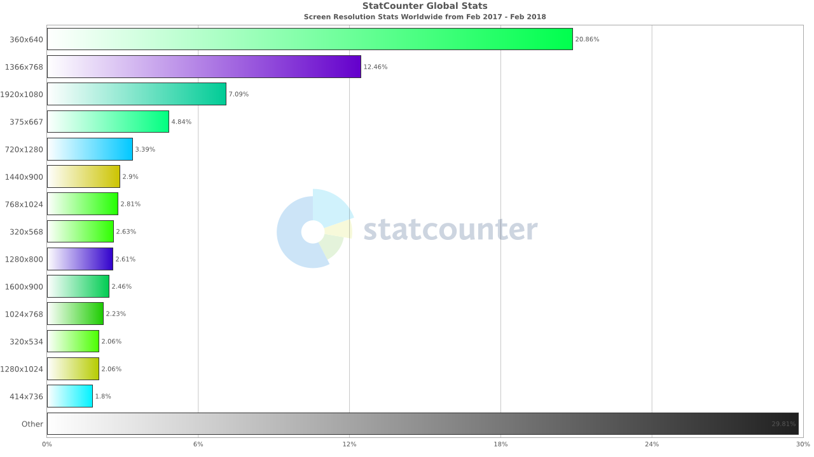
Common breakpoints based on data:
- phone (>600px)
- tablet (portrait) (>900px)
- tablet (landscape) (>1200px)
- desktop (>1800px)

PERFECT way: ignore devices and simply create design breaks based on the content of the project. Most difficult.

#### Using SASS mixins to write all our media queries
```scss
// MEDIA QUERY MANAGER
/*
0-600px:        Phone
600-900px:      Tablet portrait
900-1200px:     Tablet landscate
1200-1800px:    our normal styles apply
1800 px +       Big desktop

$breakpoint argument choices:
- phone
- tab-port
- tab-land
- big-desktop

1em = 16px
using em because it will adopt to browser font size set
*/
@mixin respond($breakpoint) {
    @if $breakpoint == phone {
        @media (max-width: 37.5em) { @content }; // 600px
    }
    @if $breakpoint == tab-port {
        @media (max-width: 56.25em) { @content }; // 900px
    }
    @if $breakpoint == tab-land {
        @media (max-width: 75em) { @content }; // 1200px
    }
    @if $breakpoint == big-desktop {
        @media (min-width: 112.5em) { @content }; // 1800px
    }
}
```

#### How to use the `@content` and `@if` SASS directives
The mixin above uses `@content` as a variable and passes all the content in the mixin call. This is very similar to a function being passed an argument. Below is an example of a use for the mixin.

Note: the order of the media mixin is very important. You want to apply them in the order shown because if for example tab-land and tab-port were reversed in order this login would happen

- tab-port: is the width < 900px -> yes -> apply these changes
- tab-land: is the width < 1200px -> also yes -> overwrite changes above and apply tab-land changes

```scss
html {
    // This defines what 1rem is.
    font-size: 62.5%; // 1rem = 10px, 10/16 = 62.5 %

    
    @include respond(tab-land) { // width < 1200?
        font-size: 56.25%; // 1rem = 9px, 9/16 = 56.25%
    }
    @include respond(tab-port) { // width < 900?
        font-size: 50%; // 1rem = 8px, 8/16 = 50% 
    }
    @include respond(big-desktop) {
        font-size: 75%; // 1rem = 12px, 12/16 = 75%
    }
}
```
#### Order of implementing media queries to SCSS 7 - 1 Architecture
The instructor recommended the following order for applying media queries
- Base + typography 
- General layout + grid
- Page layout
- Components

Big changes to grid: changed column width to 100% and marked !important to overwrite any CSS confict. This essentially changed each column to have it's own row.
```scss
.row {
    [class^="col-"] { //select all classes that start with "col-"

        @include respond(tab-port) {
            width: 100% !important;
        }
    }
```

and a few changes were made to the bottom and right margin for our columns
```scss
.row {
    max-width: $grid-width; //take up 1140px if available, 1140px is standard
    margin: 0 auto; //center row

    @include respond(tab-port) {
        max-width: 50rem; //***************** change width of row from 100% to 50rem
    }

    &:not(:last-child) { // all rows except the last one
        margin-bottom: $gutter-vertical;

        @include respond(tab-port) {
            margin-bottom: $gutter-vertical-small; // ****************** smaller space between rows
        }
    }

        [class^="col-"] { //select all classes that start with "col-"
        //background-color: orangered;
        float: left;
        
        &:not(:last-child) { //margin for all columns except the last one (furthest right)
            margin-right: $gutter-horizontal;

            @include respond(tab-port) {
                margin-right: 0; // *********** removed space on right of row
                margin-bottom: $gutter-vertical-small;
            }
        }
```

## Responsive Images

A proper responsive design not only changes the image physical dimenion in correlation to the screen size but also serves the proper image for each device. A 1 MB image served on a mobile device may be unnecessary while it would be appropriate for a desktop.

When to use responsive images: the 3 use cases
1. Resolution Switching: Decrease image resolution on smaller screens.
2. Density Switching: A high resolution screen with a pixel density of 2x vs a low resolution screen. Half the resolution on low res. screens.
3. Art Direction: Serve a different image on a smaller screen.

#### Using proper units for media queries: px, rem, or em?
<a name="emqueries"></a>
[Good article about this](https://zellwk.com/blog/media-query-units/)

The best unit to use in media queries is em as it covers browser variety well and adjusts to the user defined browser font size.

Below is an example of the Natours tours section using 900px as a break point and a user setting the browser font size to 20px. When the screen width is set to 916px the grid layout maintains it's 3 column structure.
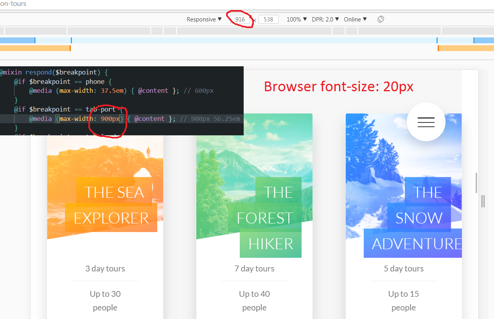

What we want is for the column layout to adjust based on the browser font size. That way things don't look so crowded like above. Below is an example of using em units in media queries break points. At 56.25em and 20px browser font size we now have a break point of 1125px screen width (56.25em*20px). So at 912px (example) screen width the column structure will colapse to single column and anything above 1125px it will go back to a three column layout.
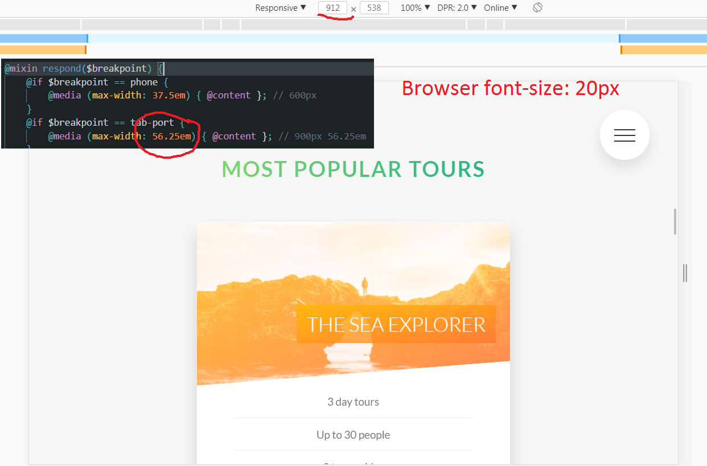
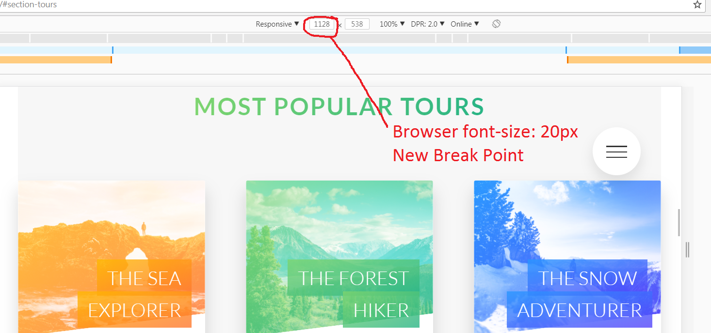

Note: why 56.25em? -> Using the default browser font size (16px) the instructor wanted to create a brake point at 900px, 900px / 16px = 56.25


#### How to use the `srcset` attribute on the  and <source> elements, together with density descriptors
This is an example of **Density Switching**.

Original HTML for footer logo
```html
<div class="footer__logo-box">
    
</div>
```
Modified HTML to use two different images
```html
<div class="footer__logo-box">
    
</div>
```
The browser will select the 1x image for low-resolution screens and 2x for high.

#### How and why to use the `<picture>` element for art direction and write HTML media queries
Using this element will enable the use of a different image based on the screen size. Below we are using **art direction** to select a different image for screen sizes smaller than 600px and also **desnity switching** to serve a different image based on screen pixel density.

The src attribute is still included for older browser support that does not use the srcset attribute.
```html
<picture class="footer__logo">
    <source srcset="img/logo-green-small-1x.png 1x, img/logo-green-small-2x.png 2x"
        media="(max-width: 37.5em)">
    <!-- for older browsers -->
</picture>
```

#### How to use resolution switching and the `sizes` attribute
First line below informs the browser of each image width without downloading them.

Second line informs the browser that the set image size (171px for this feature) will be 20 percent of the viewport width (171/900, rounded to 20%). The browser then selects the best image for the current viewport width. The 300px at the end lets the browser know the default image width anything over 900px.
```html
  <!-- for older browsers -->
```

#### Suggestions for image resolution brakepoints
So how do we decide whether to make a 100px small or 300px small image?

Take the smallest display size set on smallest device, let's say a 100px width set for the smallest breakpoint, and double it due to a 2:1 pixel ratio on high-resolution screens. So if your image is being displayed at 100px you want it to be 200px as a high resolution screen would be able to display 1 screen pixel to 1 image pixel.

#### Using the Chrome DevTools to see current image source
The Chrome inspector can be used to resize the image and see the current image source being used. Also, the pixel ratio can be switched to see the effect. The browser cache will need to be disabled under the Network tab for this to work, otherwise, the browser will not choose any other image after initial page load.


#### Screen resolution query
Uses the screen resolution (here in dots per inch) as a media query.

```scss
@media (min-resolution: 192dpi) { //Apple Retina screen resolution
    background-image: linear-gradient(
    to right bottom,
    rgba($color-primary, 0.80),
    rgba($color-primary-dark, 0.80)),
    url(../img/hero.jpg);
}
```
The instructor did mention this scenario: a phone at 600px width with a 2.0 pixel ratio displaying our hero.jpg image which is a 2000 pixel width image. It would make more sense to use the hero-small.jpg image which is 1200px wide. Below we modify the code to include a second condition to accomodate this.
```scss
@media (min-resolution: 192dpi) and (min-width: 37.5em) {
    background-image: linear-gradient(
    to right bottom,
    rgba($color-primary, 0.80),
    rgba($color-primary-dark, 0.80)),
    url(../img/hero.jpg);
}
```
Also, we can add scenario where the screen width is over 2000px to the above media query without repeating everything like this:
```scss
@media (min-resolution: 192dpi) and (min-width: 37.5em),
        (min-width: 125em) {
```
Later in the course the instructor found that `resolution` was not supported by Safari so here is the fix:
```scss
@media (min-resolution: 192dpi) and (min-width: 37.5em),
       (-webkit-min-device-pixel-ratio: 2) and (min-width: 37.5em),
       (min-width: 125em) {
```
#### Video media query
Not covered in this course but I did a little research to find best practice.

HTML5 no longer supports the `media` query inside `video` so a different approach is required. [This article](https://css-tricks.com/video-source-by-screen-size/) showed a jQuery method for doing this media query.

```javascript
var video = $('#bgVideo');

var WindowWidth = $(window).width();

if (WindowWidth < 900) {
            //It is a small screen
           video.append("<source src='img/video-xsmall.mp4' type='video/mp4' >");
} else {
            //It is a big screen or desktop
            video.append("<source src='img/video.mp4' type='video/mp4' >");
}
video.append("<source src='img/video.webm' type='video/webm' >");
```
```html
<video class="bg-video__content" id="bgVideo" autoplay muted loop>
    <!-- <source src="img/video.mp4" type="video/mp4">
    <source src="img/video.mp4" type="video/webm">
    USING JQUERY TO ADD SCR BASED ON SCREEN SIZE -->
        Your browser is not supported.
</video>
```
Here we are selecting the video element with an id of `bgVideo` and `append`ing an element based on screen size. 

**Intresting Lesson**
An interesting thing I learned here is that if you are going to use a jQuery method like `append` you need to select the element using jQuery also, so `$('#bgVideo')` and NOT `document.getElementById('bgVideo')`

To make the video smaller I used [HandBrake](https://handbrake.fr/) and [these instructions](https://www.online-tech-tips.com/computer-tips/how-to-resize-a-video/)

## Browser Support

[Caniuse](https://caniuse.com/) Check on this site to see if the CSS property works in all browsers.

#### How to use `@supports` feature queries
Below we will reduce the background opacity to 0.3 and add a background blur if the feature is supported.
```scss
.popup {
    background-color: rgba($color-black, 0.8);

    @supports (-webkit-backdrop-filter: blur(10px)) or (backdrop-filter: blur(10px)) {
        -webkit-backdrop-filter: blur(10px);
        backdrop-filter: blur(10px);
        background-color: rgba($color-black, 0.3);
    }
```
Note: `backdrop-filter` is currently only supported by Safari.

#### Another example from our project, `backface-visibility`
We earlier used `backface-visibility` on the card elements which will require a prefix for it to work in Safari. A look at Caniuse shows 
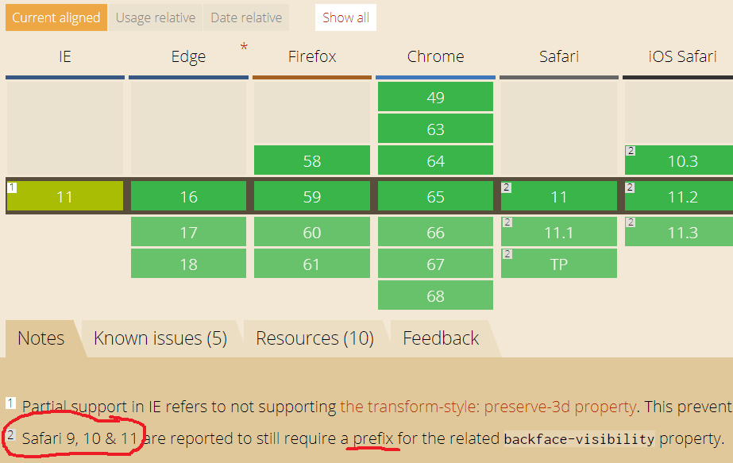
```scss
.card {
    &__side {
        -webkit-backface-visibility: hidden;
        backface-visibility: hidden;
```

## Setting up a build process with npm scrips
1. Compile `main.sass` to `style.comp.css`
2. Concatenation - combine all css files to `style.concat.css`
    - npm install concat --save-dev
    - [Documentation for npm concat](https://www.npmjs.com/package/concat)
3. Autoprefix - `style.prefix.css`
    - npm install autoprefixer --save-dev
    - npm install postcss-cli --save-dev (required to run prefixer)
4. Compressing - `style.css`
5. Build script that will run all of the above
    - npm install npm-run-all --save-dev

Whit the packages installed and package.json scrips below we can run `npm run build:css` to run all the above commands.
```json
"scripts": {
    "compile:sass": "node-sass sass/main.scss css/style.comp.css",
    "concat:css": "concat -o css/style.concat.css css/style.comp.css css/icon-font.css",
    "prefix:css": "postcss --use autoprefixer -b \"last 10 versions\" css/style.concat.css -o css/style.prefix.css",
    "compress:css": "node-sass css/style.prefix.css css/style.min.css --output-style compressed",
    "build:css": "npm-run-all compile:sass concat:css prefix:css compress:css"
  },
  ```
After we created the final verion of CSS is created we need to change the source file in `index.html` from style.css to style.min.css and we can also remove the icon-font.css file since it's been combined into the final CSS file

#### Building a script to launch development process
In order to run watch:sass and live-server we can enter both commands into seperate terminals or create another scrip
```json
"scripts": {
    "watch:sass": "node-sass sass/main.scss css/style2.css -w",
    "devserver": "live-server",
    "start": "npm-run-all --parallel devserver watch:sass",
```
## Final touches to the Natours project

#### Changing text selection color
To change the colors of selected text in the website add the following to _base.scss
```scss
::selection {
    background-color: $color-primary;
    color: $color-white;
}
```

#### Refining media query for only screens
To exclue the media queries from printing add the following to the _mixins.scss
```scss
@mixin respond($breakpoint) {
    @if $breakpoint == phone {
        @media only screen and (max-width: 37.5em) { @content }; // 600px
    }
```

#### Responsive meta tag in head of html documents
The following tag is required in the head of our html tags to make the page responsive
```html
<meta name="viewport" content="width=device-width, initial-scale=1.0">
```

#### Identifing touch devices 
While we do have media queries set up to change the layout of the rotating cards to display all the content without rotation on small screens there are still scenarios that aren't covered. An example would we an iPad in landscape mode. Here the user doesn't have the ability to hover and the media query has not been triggered.

Solution is to add condition into the card media query. Since we were using a mixin (@include resopond(tab-port)) we can't add the condition here so we just write out the media query and add the condition.
```scss
@media only screen and (max-width: 56.25em),
only screen and (hover: none) {
```


